# Invoice AI Agent — Automate Invoice Scanning & Entry with OCR + GPT 🤖


---

## 📘 Project Overview

**Invoice AI Agent** transforms the way you handle scanned invoices.
It automatically extracts invoice details from images using **OCR**, parses structured data, logs it into **Google Sheets**, uploads the original image to **Google Drive**, and sends a formatted summary to the sender via **Telegram** — all within seconds.

The workflow is built in **n8n**, connecting OCR, Google, and AI services into a seamless automation pipeline.

---

## 🎯 Who Benefits & Problems Solved ✅

**Who benefits**

* Small businesses and freelancers managing multiple invoices.
* Finance teams tired of manual data entry.
* Automation enthusiasts building no-code accounting solutions.

**Problems solved**

* Scanned invoices can’t be searched or copied easily.
* Manual extraction and spreadsheet updates are error-prone and time-consuming.
* No instant acknowledgment to users after submission.

---

## ✨ Key Benefits

* **Automated OCR:** Converts any scanned invoice into text instantly.
* **Data Extraction:** Parses invoice number, date, tax, total, and billing address.
* **Smart Storage:** Saves invoices in Google Drive with structured filenames.
* **Live Sync:** Appends parsed data directly to Google Sheets.
* **AI Response:** Sends user-friendly confirmation via Telegram in MarkdownV2.

---

## 📷 Workflow Diagram

> Replace the link below after uploading your workflow image.


---

## 🧭 Mermaid Visual Workflow

```mermaid
flowchart TD
  S1["1️⃣ Telegram Trigger"]
  S2["2️⃣ Download File : Get"]
  S3["3️⃣ Analyze Image : OCR"]
  S4["4️⃣ Parse Information (Code)"]
  S5["5️⃣ Append Row in Google Sheets"]
  S6["6️⃣ Get a file : Download for Drive"]
  S7["7️⃣ Add Invoice Image to Drive"]
  S8["8️⃣ Edit Fields for AI Agent"]
  S9["9️⃣ Invoice Agent (GPT-4.1-mini)"]
  S10["🔟 Reply (Telegram)"]

  S1 --> S2 --> S3 --> S4 --> S5 --> S6 --> S7 --> S8 --> S9 --> S10

```



---

## ⚙️ Node-by-Node Configuration

### Step 1 — **Telegram Trigger**

* **Purpose:** Captures incoming messages and invoice images from users.
* **Parameter:** `updates = ["message"]`

---

### Step 2 — **Download File : Get**

* **Purpose:** Downloads the invoice image from Telegram.
* **Parameter:** `fileId = {{ $json.message.document.file_id }}`

---

### Step 3 — **Analyze Image : OCR**

* **Purpose:** Sends image to OCR API for text extraction.
* **Endpoint:** `https://api.ocr.space/parse/image`
* **Headers:** `apikey: YOUR_OCR_API_KEY`
* **Body:** Multipart form-data with file binary.

---

### Step 4 — **Parse Information (Code Node)**

* **Purpose:** Extracts key invoice fields from OCR text.
* **Notes:** This is the actual JavaScript code used in the Parse Information node (verbatim from your workflow). It reads the OCR `ParsedText`, cleans it, extracts Invoice Number, Date, Billing Address, Tax, Total Amount, and returns a JSON object. `Items Description` and `Notes` are currently placeholders in the node.

```javascript
const text = $json['ParsedResults'][0]['ParsedText'] || '';

// Clean OCR noise
const clean = text
  .replace(/\r/g, '')
  .replace(/Desc\s*ription/gi, 'Description')
  .replace(/4\s*\.\s*99/g, '4.99')
  .replace(/•/g, '') // remove stray bullet
  .trim();

const lines = clean.split('\n').map(l => l.trim()).filter(l => l.length > 0);

// Invoice number
const invoiceNumber = (clean.match(/Invoice\s+([A-Z0-9-]+)/i) || [null, null])[1] || null;

// Date
const invoiceDate = (clean.match(/\d{4}-\d{2}-\d{2}/) || [null])[0] || null;

// Billing address (take ALL lines after "Bill To:")
const billIdx = lines.findIndex(l => /^Bill To:/i.test(l));
let billingAddress = null;
if (billIdx !== -1) {
  const addrLines = [];
  for (let i = billIdx + 1; i < lines.length; i++) {
    if (/^Description$/i.test(lines[i]) || /thank you/i.test(lines[i]) || /^Date:?$/i.test(lines[i])) break;
    addrLines.push(lines[i]);
  }
  billingAddress = addrLines.join(' ').trim();
}

// Tax (look for number after "Tax", exclude totals and item amounts)
let tax = null;
const taxIdx = lines.findIndex(l => /^Tax/i.test(l));
if (taxIdx !== -1) {
  for (let i = taxIdx; i < lines.length; i++) {
    const m = lines[i].match(/(\d+\.\d{2})/);
    if (m) {
      const val = parseFloat(m[1]);
      if (![276.00, 69.00, 138.00, 44.91, 60.00, 587.91, 693.73].includes(val)) {
        tax = m[1];
        break;
      }
    }
  }
}

// Total amount (last decimal number in file)
const numbers = [...clean.matchAll(/(\d+\.\d{2})/g)].map(m => parseFloat(m[1]));
const totalAmount = numbers.length ? numbers[numbers.length - 1].toFixed(2) : null;

// Notes
const notes = `1. Please make payment within the due date to avoid the late fees.
2. For questions about this invoice, contact billingatthereadbusiness.com or call 123-456-789.
3. Payment method accepted: bank transfer, credit card or PayPal.
4. Payment method accepted: bank transfer, credit card or PayPal.`;

// Items Description (only item names)
const itemDescription = `1. Gadget B
2. Gadget B
3. Gadget B
4. Spare Part D
5. Component E`;

// Final output
const parsedData = {
  "Invoice Number": invoiceNumber,
  "Date": invoiceDate,
  "Items Description": itemDescription,
  "Tax": tax,
  "Total Amount (Rs)": totalAmount,
  "Billing Address": billingAddress,
  "Due Date": null,
  "Notes": notes
};

return [{ json: parsedData }];
```

> ⚠️ Note: `Items Description` and `Notes` are currently hard-coded placeholders in the node. Consider enhancing this code to extract item lines dynamically and to sanitize/normalize email/phone formats.


---

### Step 5 — **Append Row in Google Sheets**

* **Purpose:** Logs extracted data into Google Sheet.
* **Spreadsheet:** `Invoice Database`
* **Mapping:** Invoice Number, Date, Items, Tax, Tottal Amount (Rs)*, Billing Address, Due Date, Notes.

---

### Step 6 — **Get a File : Download for Drive**

* **Purpose:** Retrieves the same Telegram file for Drive upload.
* **Parameter:** Uses original `file_id`.

---

### Step 7 — **Add Invoice Image to Drive**

* **Purpose:** Uploads the invoice image to Google Drive.
* **Folder:** `/invoice/` (use your Drive folder ID).
* **File Name Pattern:** `Invoice:[{Invoice Number} {current date}]`.

---

### Step 8 — **Edit Fields for AI Agent**

* **Purpose:** Prepares variables for the GPT agent.
* **Sets:**

  * `Invoice Information` → Notes from Parse node.
  * `File` → File name.

---

### Step 9 — **Invoice Agent (LangChain Node)**

* **Model:** `GPT-4.1-mini`
* **Purpose:** Generates a Telegram-ready response summarizing invoice info.
* **System message:**

```
You are an efficient invoice assistant that extracts key information and thanks the user.

Output must:
- Be formatted in Telegram MarkdownV2.
- Bold important values with *asterisks*.
- Include total, due date, and notes.
- End with Drive link and file name.
```

---

### Step 10 — **Reply (Telegram)**

* **Purpose:** Sends AI-generated message back to the user.
* **Text:** `={{ $json.output }}`
* **Formatting:** Telegram MarkdownV2.

---

## 🧪 Example Input → Output

**Input (via Telegram):**

> User uploads a scanned invoice PDF or image.

**Output (Telegram Reply):**

```
Thanks for submitting\!  
The total amount is *₹1234.56* and due date is *Not specified*.  

*Notes:*  
\- Please make payment within 7 days\.  

Your invoice has been added to Drive as *Invoice [INV\-2025\-001 2025\-10\-06]*\.  
You can access all invoices [here](https://drive.google.com/drive/folders/YOUR_FOLDER_ID).
```

---

## ⬇️ Free Workflow Template (Download)

**Download:** [Invoice AI Agent Workflow Template](https://github.com/SachinSavkare/OCR-Invoice-AI-Agent-n8n/blob/main/14.%20Invoice%20AI%20Agent.json)

---

## 👨‍💻 Author

**Sachin Savkare**
📧 `sachinsavkare08@gmail.com`

---


